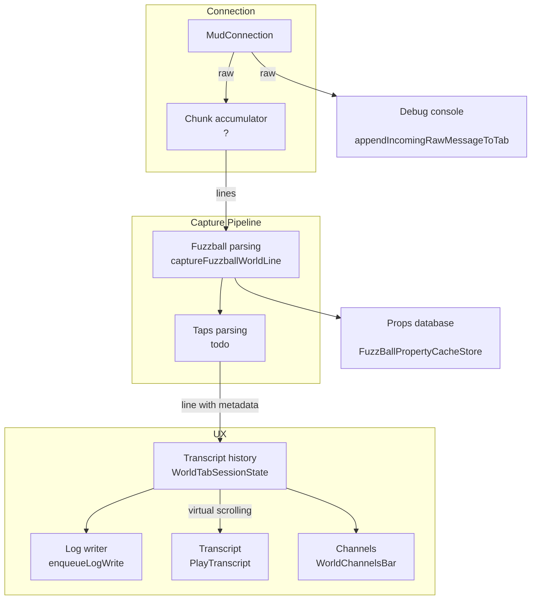

```mermaid
flowchart TB
  MC[MudConnection]
  Chunk[
    Chunk accumulator
    ?
  ]
  Fuzz[
    Fuzzball parsing
    captureFuzzballWorldLine
  ]
  Props[
    Props database
    FuzzBallPropertyCacheStore
  ]
  Debug[
    Debug console
    appendIncomingRawMessageToTab
  ]
  Hist[
    Transcript history
    WorldTabSessionState
  ]
  Taps[
    Taps parsing
    todo
  ]
  Log[
    Log writer
    enqueueLogWrite
  ]
  Tran[
    Transcript
    PlayTranscript
  ]
  Chan[
    Channels
    WorldChannelsBar
  ]

  subgraph Connection
  MC -->|raw| Chunk
  end

  MC -->|raw| Debug

  subgraph Capture Pipeline
  Chunk -->|lines| Fuzz
  Fuzz --> Taps
  end

  Fuzz --> Props

  subgraph UX
  Taps -->|line with metadata| Hist
  Hist -->|virtual scrolling| Tran
  Hist --> Log
  Hist --> Chan
  end

```
