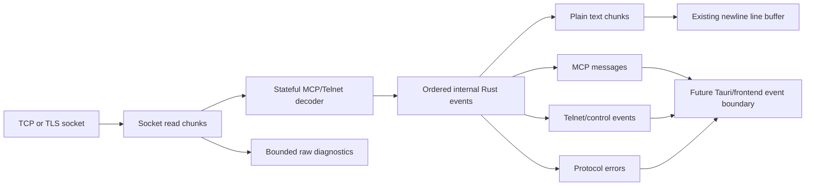
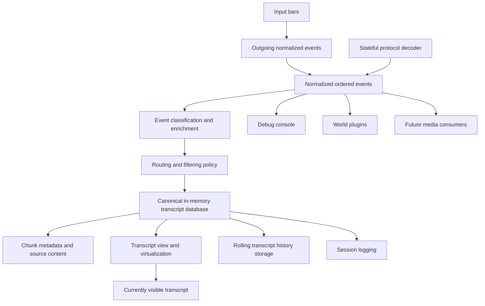
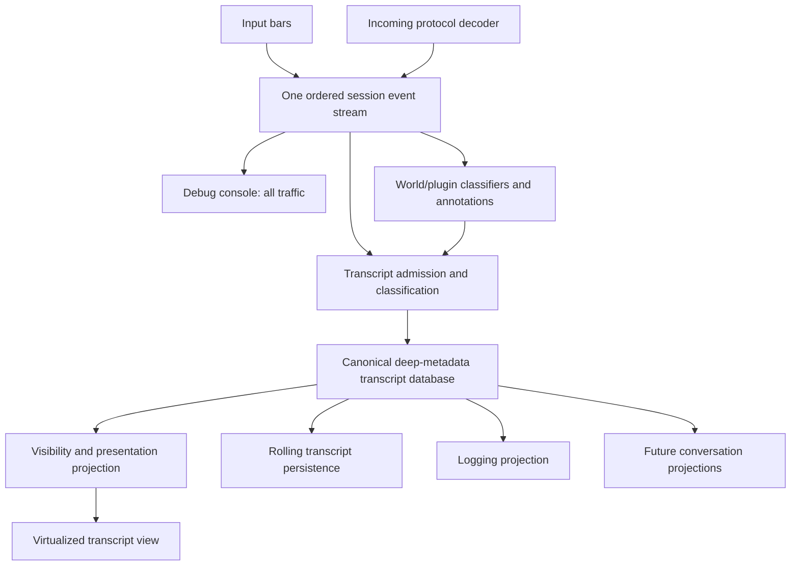

# MCP Protocol Pipeline Plan

## Scope

This plan proves the protocol-pipeline structure with MCP only. The first
implementation is Rust-side and test-first. It must establish a reusable
connection-boundary decoder without adding frontend integrations yet.

The first milestone must not implement GMCP, MCMP, world settings, plugin
hooks, transcript changes, media handling, or frontend event contracts. Those
features may consume the Rust boundary established here in later plans.

## Connection Model

MCP, GMCP, and MCMP are in-band protocols for one world connection. They do
not require separate sockets or separate connection workers:

- MCP messages are carried in the negotiated Telnet stream.
- GMCP messages are carried in Telnet subnegotiation on that same stream.
- MCMP is classified from GMCP packages on that same stream.
- Plain text, Telnet control traffic, protocol messages, and protocol errors
  must retain their order within the one connection event stream.
- TLS, when enabled, wraps the same transport connection; it does not create a
  second protocol connection.

Protocol families may have separate decoder modules or adapters behind the
shared connection boundary, but they must not create parallel socket readers
or independent event streams. Protocol-specific world behavior belongs in
downstream consumers or plugins that receive normalized events.

Any future fetch of a remote MCMP media URI is an optional, policy-controlled
resource operation after protocol decoding. It is not part of the world
protocol connection and must not be required for protocol parsing or basic
session operation.

## Phase Summary

- [ ] Phase 1: Confirm the MCP wire format, scope, and failure behavior.
- [ ] Phase 2: Define the internal Rust event model and decoder boundary.
- [ ] Phase 3: Implement the stateful MCP decoder with bounded buffering.
- [ ] Phase 4: Integrate the decoder with the Rust connection worker.
- [ ] Phase 5: Add unit and worker-level Rust tests.
- [ ] Phase 6: Verify diagnostics, event ordering, and regression behavior.
- [ ] Phase 7: Record implementation-specific MCP details and defer future
  frontend, GMCP, and MCMP work to follow-up plans.

## Pipeline Sketch

The first milestone should establish this Rust-side flow:

The decoder is the single interpretation point for bytes arriving from the
socket. It retains incomplete framing state across reads and emits events in
the same order in which the corresponding bytes appeared. Ordinary text is
the only event type that enters the existing transcript line buffer.

The shared boundary should remain modular internally. A later implementation
may compose a Telnet decoder with MCP and GMCP adapters, followed by an MCMP
classifier above GMCP, but all of them must emit into the same ordered event
stream. These adapters are protocol infrastructure, not separate world
connections.

For this milestone, MCP events, control events, and protocol errors stop at an
internal Rust diagnostic or test boundary. The future Tauri/frontend boundary
is shown to establish the intended extension point, but it is not part of the
MCP proof implementation.

The eventual complete pipeline should preserve the same fan-out shape:

Protocol events must reach routing and plugin consumers without first being
flattened into transcript strings. The routing stage may independently decide
whether an event is visible in the transcript, debug console, a world channel,
a structured surface, a media consumer, or only diagnostics. Storage and
visibility remain separate decisions.

Sentinel traffic follows the same ordered event stream. A plugin or host-owned
capture service may emit an outgoing sentinel request, and the matching world
response must remain identifiable as a sentinel event after protocol decoding
and text framing. Routing may hide that response from the visible transcript
while retaining it in the canonical transcript/history database for capture
completion, diagnostics, replay, or future projections.

The canonical transcript database is the first transcript consumer of ordered
text events. It must retain the source text and the metadata needed to
re-render chunks, including ordering, line counts, timestamps, event type, and
future protocol or classification metadata. Virtualization is a view over this
store, not a second transcript store.

The visible transcript must be derived from the canonical store after display
rules are applied. This allows a changed trigger, filter, formatting rule, or
configuration to re-evaluate retained history and change what is shown without
reconstructing the session from the network or from an already-rendered view.

Rolling transcript history persistence and session logging must also consume
the canonical store. They must not independently rebuild transcript content
from rendered DOM, virtualized rows, or a separate post-processing stream.

The eventual transcript integration must:

- [ ] Insert printable ordered events into one canonical in-memory transcript
  database before visibility or rendering decisions are made.
- [ ] Retain source content and re-renderable metadata for every retained
  transcript chunk.
- [ ] Keep virtualization as a projection over the canonical store rather than
  treating rendered rows as the source of truth.
- [ ] Re-evaluate retained chunks when visibility, trigger, filtering, or
  presentation configuration changes.
- [ ] Derive visible transcript output from the current rules applied to the
  canonical store.
- [ ] Derive rolling transcript history persistence from the canonical store.
- [ ] Derive session logging from the canonical store while preserving the
  existing rule that logs contain the visible transcript representation.
- [ ] Define how updates to display rules affect already-written log entries;
  do not rewrite existing log files implicitly unless a later feature
  explicitly requires it.

### Input Admission

Input submission is part of the same ordered session event stream as incoming
traffic. The current product captures outgoing input in the debug console but
does not yet store it in the transcript. The target design stores every
submitted input entry in the canonical transcript database and lets the echo
projection decide whether it is visible.

The transcript layer must make storage and visibility separate decisions:

- [ ] Create an outgoing input event when an input bar submits text, before the
  connection sends the bytes.
- [ ] Preserve input ordering relative to incoming and protocol events for the
  session.
- [ ] Send outgoing input events to the debug console regardless of whether
  they are visible in the transcript.
- [ ] Store locally submitted commands, automatic connection strings, and
  protocol-generated replies as distinct outgoing entry kinds.
- [ ] Preserve the current default of excluding submitted input from the
  visible transcript unless the product explicitly enables command echo.
- [ ] Apply visibility, trigger, formatting, history, and logging rules to
  outgoing entries using the same canonical-store machinery as other
  transcript entries.

For the MCP proof, the Rust event boundary may stop before this frontend
transcript database. The plan must nevertheless preserve this eventual shape:
new protocol decoders feed the ordered event stream, and the transcript store
remains the first consumer of printable text in the frontend pipeline.

## Transcript Database Assessment

The current implementation does not yet match this target architecture:

- `PlayTranscript` is the live transcript store, but it retains only text,
  line count, character count, timestamp, and a numeric chunk id.
- `CanonicalTranscriptStore` exists as an unused prototype and is not the
  store connected to world sessions.
- Submitted input is captured in the debug console by the connection wrapper,
  but it is not inserted into `PlayTranscript` or persisted in transcript
  history.
- Persisted transcript history stores only `{ text, lines }`, so it cannot
  restore entry type, ordering metadata, protocol classification, source
  identity, or future visibility annotations.
- Trigger rules are currently applied while rendering chunk text. They can
  style content and stop later highlighting, but they do not remove chunks or
  produce a reusable visibility projection.
- Virtualization calculates visible ranges over all existing chunks. It does
  not decide which chunks exist in the transcript or provide an alternate
  filtered conversation view.

The intended design is therefore to make input a first-class entry in the
canonical in-memory transcript database even when the current visible
transcript hides it. Visibility must be a projection decision, not a storage
decision. This allows an echo option to switch previously retained input into
or out of the visible transcript without reconstructing the session.

The initial echo setting may be hardcoded or have a temporary default, but the
entry model must leave room for its eventual scope to be app-wide, world-wide,
or character-specific. The first implementation should avoid baking that
scope into the storage shape.

The pipeline should conceptually become:

Input should enter `Ordered` before the connection sends it, and should enter
`Store` as an outgoing entry. The current default visibility can hide outgoing
entries, but hidden entries remain available to the debug console, scrollback
metadata, future echo changes, and conversation-related projections.

The transcript database must be richer than rendered HTML or plain persisted
text. It should retain, at minimum, stable identity, sequence/order, timestamp,
direction, entry kind, source text, normalized text, line and character
metrics, protocol/source metadata, plugin classifications, and visibility or
annotation state. Rendered HTML and virtualization measurements remain
discardable caches.

### Required Transcript-Architecture Work

- [ ] Replace or adapt `PlayTranscript` so it is backed by the canonical
  deep-metadata entry model used by the active world session.
- [ ] Make submitted input enter the canonical store as an outgoing entry
  before or at send time, including automatic connection strings as a distinct
  source kind.
- [ ] Keep input in the store even when the current echo policy hides it from
  the visible transcript.
- [ ] Expand rolling transcript history persistence to retain the metadata
  required for replay and projection, not only `{ text, lines }`.
- [ ] Define a versioned persisted-entry format and migration behavior for
  existing text-only transcript history.
- [ ] Preserve stable entry identity and event order across in-memory updates,
  reload, re-rendering, and projection changes.
- [ ] Separate canonical entries from rendered HTML, render-cache entries, and
  virtualization measurements.
- [ ] Define a typed view-range contract for selection so a large selection can
  identify chunk IDs and character offsets without storing the selection as
  rendered DOM state.
- [ ] Keep transient transcript interface markers, including last-activity and
  selection indicators, outside the canonical transcript database and ordered
  transcript persistence.
- [ ] Add a transcript admission/classification stage that can accept incoming
  text, outgoing input, system messages, and future plugin annotations.
- [ ] Define the initial echo policy with a temporary default while keeping
  app, world, and character scope available to a later settings decision.
- [ ] Make visibility a projection over stored entries so changing echo or
  future mute/gag rules can update old scrollback.
- [ ] Ensure projection changes invalidate render caches and recompute visible
  item counts, heights, anchors, and scroll position safely.
- [ ] Keep rolling history persistence based on canonical entries and explicit
  retention rules rather than the currently visible virtualized rows.
- [ ] Make logging consume an explicit projection of canonical entries so
  later filtering can independently control what is logged without deleting
  source entries.
- [ ] Preserve debug-console capture of every direction independently from
  transcript visibility.
- [ ] Ensure range-copy actions extract canonical transcript text and do not
  include between-chunk UI markers.
- [ ] Add tests proving hidden input remains stored and becomes visible when
  the echo projection changes.
- [ ] Add tests proving a projection change re-evaluates old entries without a
  network replay.

### Specification Placement

The behavior belongs across existing specifications rather than in the MCP
wire-format section alone:

- [ ] Update `spec/output.md` to define the canonical transcript database,
  outgoing input entries, echo visibility, projection-based re-rendering, and
  virtualization as a view concern.
- [ ] Update `spec/logging.md` to define logging as a projection of canonical
  transcript entries and to distinguish source retention from logged output.
- [ ] Update `spec/triggers.md` when trigger actions expand from styling into
  visibility, muting, gagging, or log inclusion decisions.
- [ ] Update `spec/surfaces.md` when conversation surfaces consume canonical
  entries or control their transient main-transcript visibility.
- [ ] Update `spec/di.md` if the canonical transcript store becomes a
  world-session-scoped service shared by transcript, logging, plugins, and
  conversation projections.
- [ ] Keep `spec/protocols.md` focused on ordered protocol events and pipeline
  boundaries, referring to the transcript specifications for view and
  persistence behavior.

### Future Projection Consumers

Conversation and page surfaces should be projections over the same canonical
transcript database, not separate copies of incoming text. They are out of
scope for the MCP proof and this plan does not define their matching rules.
The architecture should nevertheless leave room for:

- [ ] A transient conversation projection that selects entries by plugin or
  classifier metadata.
- [ ] A per-surface policy controlling whether selected entries remain visible
  in the main transcript.
- [ ] Temporary hide/show changes that do not alter persisted world or
  character settings.
- [ ] Plugin-provided classifications, such as names or conversation groups,
  that can be attached to canonical entries without owning transcript storage.
- [ ] Multiple views over one entry identity so a message can appear in a
  conversation surface and, when policy allows, in the main transcript.
- [ ] Define sentinel projections so plugin-generated self-responses can be
  retained in canonical history while being muted from the main transcript
  and, by explicit policy, from logs or conversation channels.

## Current Boundary

The existing connection worker in `tauri/src/mud_backend.rs` reads TCP bytes,
strips Telnet control sequences, emits a raw text event, and sends the
remaining bytes to a newline buffer. This is insufficient for MCP because it
can discard protocol framing before a consumer can identify or preserve it,
and its framing state does not survive independently across reads.

The MCP proof must introduce a stateful Rust decoder between socket reads and
the existing event emission code. The decoder should be independently
testable, while the worker integration should remain as small as possible.

## MCP Scope Definition

- [ ] Confirm the MCP wire-format reference and record the exact framing,
  escaping, negotiation, message boundaries, and termination rules used by
  the implementation.
- [ ] Document which MCP messages are recognized in this first milestone and
  which messages are preserved as unknown MCP traffic.
- [ ] Define the behavior for MCP traffic that is malformed, truncated,
  oversized, unsupported, or interleaved with ordinary text.
- [ ] Define whether MCP negotiation responses are generated automatically by
  the decoder or surfaced to the connection worker as outgoing protocol
  actions.
- [ ] Keep all MCP-specific behavior behind a reusable protocol-decoder
  boundary so later GMCP and MCMP decoders can share the structure without
  sharing assumptions about their wire formats.

## Rust Event Model

- [ ] Define an internal Rust event type that distinguishes plain text,
  Telnet/control traffic, MCP messages, unknown protocol traffic, and protocol
  errors.
- [ ] Include traffic direction or otherwise keep incoming and outgoing
  protocol actions distinguishable at the boundary.
- [ ] Preserve the original MCP payload or bounded raw representation with
  each decoded MCP event.
- [ ] Include decoded MCP fields separately from the original representation
  so future consumers do not need to parse the message again.
- [ ] Include enough ordering information to preserve the sequence of text and
  MCP events emitted from the same socket stream.
- [ ] Keep the event model internal to Rust for this milestone; do not expose a
  new Tauri command or frontend serialization contract yet.

## Stateful Decoder

- [ ] Add a dedicated Rust module or type for MCP decoding rather than adding
  more protocol branches directly to `run_connection`.
- [ ] Feed arbitrary byte chunks into the decoder and return zero or more
  ordered protocol events for each chunk.
- [ ] Preserve incomplete MCP frames between calls.
- [ ] Handle a complete MCP frame split at every meaningful boundary.
- [ ] Handle multiple MCP frames in one input chunk.
- [ ] Handle ordinary text before, between, and after MCP frames.
- [ ] Preserve text bytes without allowing MCP framing bytes into the text
  event stream.
- [ ] Handle Telnet escaping and MCP framing without relying on a single TCP
  read containing a complete command.
- [ ] Provide an explicit end-of-stream or flush operation for partial input.
- [ ] Emit a classified error or incomplete-frame event when flushing finds
  unfinished MCP input.
- [ ] Ensure decoder state can be reset cleanly when a connection is replaced
  or disconnected.

## Connection Worker Integration

- [ ] Replace the current pre-decoding `strip_telnet` path with the stateful
  decoder at the socket-read boundary.
- [ ] Preserve the existing connection lifecycle and failure behavior while
  routing decoded text through the existing line buffer.
- [ ] Keep the existing raw/debug behavior available during the proof, but
  source it from the new decoder boundary so protocol bytes are not silently
  lost.
- [ ] Define how decoded MCP events are observed inside Rust without adding a
  frontend listener yet.
- [ ] Keep automatic protocol replies, if required by MCP, on the same
  serialized outgoing path as user data.
- [ ] Ensure decoder errors do not terminate an otherwise healthy connection
  unless the transport or configured safety policy requires termination.
- [ ] Ensure connection replacement cannot allow events from an old decoder
  instance to reach the new session.

## Safety Limits

- [ ] Define bounded maximum sizes for an MCP frame, an incomplete buffered
  frame, and any decoded MCP field.
- [ ] Enforce the limits before allocations can grow without bound.
- [ ] Emit a deterministic protocol error when an MCP limit is exceeded.
- [ ] Discard only the affected frame or bounded recovery unit when recovery is
  safe.
- [ ] Add tests proving malformed or oversized MCP input cannot cause unbounded
  buffering.

## Rust Test-First Work

- [ ] Add unit tests for the MCP decoder before integrating it into the socket
  worker.
- [ ] Test an empty input chunk and a chunk containing only ordinary text.
- [ ] Test one complete MCP message.
- [ ] Test multiple MCP messages in one chunk.
- [ ] Test text and MCP messages interleaved in both orders.
- [ ] Test every frame boundary split across separate decoder calls.
- [ ] Test Telnet escaping and command bytes split across decoder calls.
- [ ] Test unknown MCP message names or commands according to the defined
  preservation policy.
- [ ] Test malformed headers, delimiters, escapes, and payloads.
- [ ] Test incomplete input followed by a clean end-of-stream flush.
- [ ] Test oversized frames and oversized fields.
- [ ] Test event ordering for mixed text and MCP input.
- [ ] Test decoder reset between sessions.
- [ ] Add worker-level tests for forwarding decoded text to the existing line
  buffer.
- [ ] Add worker-level tests for preserving or classifying MCP events without
  requiring a frontend listener.
- [ ] Add regression tests showing ordinary Telnet text behavior remains
  unchanged.
- [ ] Run the existing Rust test suite and the repository's existing frontend
  tests to verify this Rust-only milestone does not regress current behavior.

## Diagnostics for the Proof

- [ ] Add a Rust-side diagnostic representation or test hook that makes the
  ordered decoded event stream inspectable without exposing it to the
  frontend.
- [ ] Include raw MCP bytes, decoded MCP data, and parser errors in diagnostic
  assertions where applicable.
- [ ] Verify that protocol bytes are not accidentally emitted as ordinary
  transcript text by the worker's line-buffer input.
- [ ] Keep diagnostic output bounded and avoid logging full payloads by
  default when a test payload could be sensitive or very large.

## Acceptance Criteria

- [ ] A stateful Rust MCP decoder exists independently of the frontend.
- [ ] The decoder handles fragmented, combined, interleaved, malformed, and
  oversized input deterministically.
- [ ] The connection worker uses the decoder before text line buffering.
- [ ] MCP traffic is represented distinctly from ordinary text inside Rust.
- [ ] Existing connection lifecycle behavior remains intact.
- [ ] Rust tests cover the decoder and its worker boundary.
- [ ] No frontend protocol integration is required to consider this milestone
  complete.

## Deferred Work

- [ ] Define the frontend serialization contract for normalized protocol
  events.
- [ ] Add frontend connection callbacks for protocol events.
- [ ] Route MCP events to the debug console, plugins, or other frontend
  consumers.
- [ ] Define the host routing and filtering contract for transcript, status,
  debug-console, channel, structured-surface, media, and diagnostics
  consumers.
- [ ] Define the normalized outgoing/incoming sentinel event contract,
  including request identity, token matching, ordering, timeout, cancellation,
  and duplicate handling.
- [ ] Define typed plugin subscriptions for normalized protocol events without
  exposing socket access or requiring plugins to decode protocol framing.
- [ ] Define whether plugins request sentinels through a host-owned capture
  service or through a general outgoing-command capability.
- [ ] Define the renderer and snapshot contracts for structured text, trees,
  tables, status/HUD panels, and safe media metadata surfaces.
- [ ] Add world-level MCP configuration and storage migration.
- [ ] Add GMCP support using the reusable decoder structure.
- [ ] Add MCMP-over-GMCP support and media safety policy.
- [ ] Preserve the one-connection model when adding GMCP and MCMP; protocol
  adapters must share the connection worker and ordered event stream.
- [ ] Treat any future remote media retrieval as a separate, optional,
  policy-controlled resource operation rather than a protocol connection.
- [ ] Update the canonical protocol specification with implementation-specific
  MCP wire-format details once the reference and decoder behavior are settled.

## Related Plans

- `PLAN_CAPTURE.md` defines sentinel capture semantics, matching, completion
  signals, and fallback behavior built on this ordered event stream.
- `PLAN_PLUGIN.md` defines how world plugins consume normalized protocol events
  and request host-managed sentinel behavior.
- `PLAN_CHANNELS.md` defines the routing destination policy for capture output,
  including the unresolved question of routing retained sentinel events.
- `PLAN_DI_WORLD_SESSION.md` covers session-scoped ownership for services that
  may consume protocol and transcript events.
